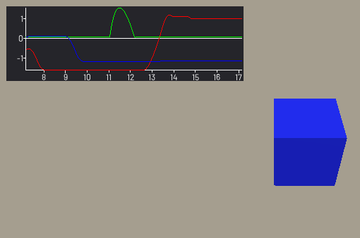

For a more complete solution, check out [easy-charts](https://github.com/fenix-hub/godot-engine.easy-charts)

Godot plotting script
=====================

This is a simple plotting system intended for debugging. Easily plot time-based data such as position, speed, forces, network latency, AI data, etc.

All you have to do is attach the script to a `Panel` control and call `record_point("character position", my_object.translation.x)`

  
*Plotting the position as 3 curves with default colors*

Features
--------

* Single script
* Plot multiple curves on a single panel, with specific or automatic colors
* Configurable time horizon (default: 10 seconds)
* Automatically adjust to the vertical range of the data
* Show numerical values on axes

Potential future enhancements, if requested
-------------------------------------------

* More customization options (sizing, background color, axes color)
* Plot non-time-based data
* Other plot types (bars, ...)
* Mouse interaction (show/hide curves, pan/zoom, show value on hover)
